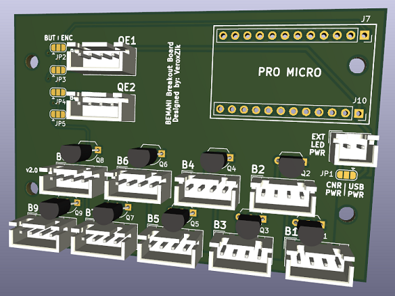

# ProMicro Breakout

## Description

This board uses the Sparkfun Pro Micro as its base and supports 4 pin button connectors using the DJ DAO layout.

It is configurable for one of the three options:
1. 9 buttons, no encoders
2. 8 buttons, 1 encoder
3. 7 buttons, 2 encoders

## Bill of Materials

| Part | Description | Qty | Link |
|:---|:---|:---:|:---|
| Arduino Pro Micro | Microprocessor | 1 | Search "Pro Micro" on Aliexpress, ensure the listing says 32U4 |
| JST XH 4P Header | Connector for buttons and encoder | 11 | https://www.lcsc.com/product-detail/Wire-To-Board-Wire-To-Wire-Connector_BOOMELE-Boom-Precision-Elec-XH-4A_C37815.html |
| JST XH 2P Header | Connector for external power (optional) | 1 (optional) | https://www.lcsc.com/product-detail/Wire-To-Board-Wire-To-Wire-Connector_BOOMELE-Boom-Precision-Elec-XH-2A_C20079.html |
| 2N7000 | MOSFET 60V 0.2A N-Channel TO-92 | 9 | https://www.lcsc.com/product-detail/MOSFETs_Jiangsu-Changjing-Electronics-Technology-Co-Ltd-2N7000_C9114.html |

Connectors can also be found on Aliexpress by searching "JST XH".

## Configuration

### Power Selection

Typically, you will be using USB power for this board. Solder the middle and right pads together on jumper JP1.

By soldering the other two pads, the LEDs will be powered via the JST XH 2P connector. This can allow you to use 12V leds, if this is desired.

### Button and Encoder Selection

Next to each QE connector is a pair of solder jumpers.

To use QE1, solder the middle and right pads together for jumpers JP2 and JP3. Otherwise, solder the middle and left pads to use Button 9.

To use QE2, solder the middle and right pads together for jumpers JP4 and JP5. Otherwise, solder the middle and left pads to use Button 8.