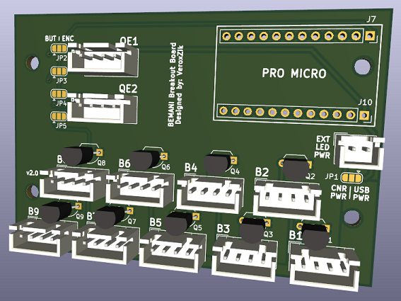

# Board Selection

Use the following guide to help you figure out which board suits your purposes.

These boards are designed for quadrature encoders. They *do not* support potentiometers.

## Micro Breakout

This board uses the Arduino Micro as its base and supports 4 pin button connectors using the DJ DAO layout.

It is configurable for one of the three options:
1. 12 buttons, no encoders
2. 11 buttons, 1 encoder
3. 10 buttons, 2 encoders

## Micro Breakout + RGB

This board uses the Arduino Micro as its base and supports 4 pin button connectors using the DJ DAO layout.

It is configurable for one of the three options:
1. 11 buttons, no encoders
2. 10 buttons, 1 encoder
3. 9 buttons, 2 encoders

In addition, there is a header for ARGB leds (WS2812B or APA102).

## ProMicro Breakout

This board uses the Sparkfun Pro Micro as its base and supports 4 pin button connectors using the DJ DAO layout.

It is configurable for one of the three options:
1. 9 buttons, no encoders
2. 8 buttons, 1 encoder
3. 7 buttons, 2 encoders

## ProMicro Breakout + RGB

This board uses the Sparkfun Pro Micro as its base and supports 2 pin buttons. It does not support button LEDs.

It supports 12 buttons and 2 encoders.

In addition, there is a header for ARGB leds (WS2812B or APA102).